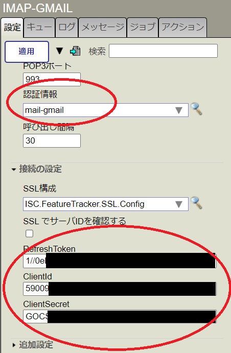
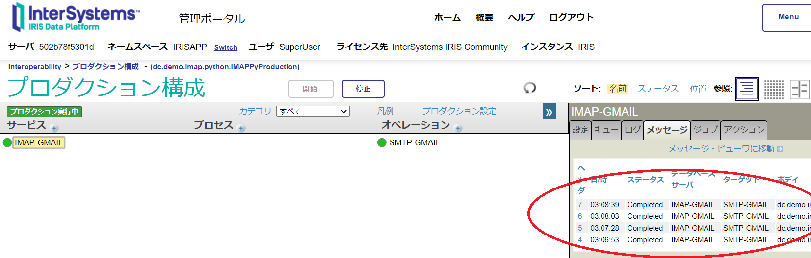

# iris-imap-inbound-adapter-demo

オリジナルの[「InterSystems IRIS で Python を使って IMAPクライアントを実装する」](https://jp.community.intersystems.com/node/512311)は、埋め込みPythonを使用してIMAPインバウンドアダプタを実装されていますが、最近メールプロバイダがあいついでoAuth2認証しか受け付けなくなってきているので、その対応をしてみました。

本稿の[GitHub](https://github.com/IRISMeister/iris-imap-inbound-adapter-demo.git)はこちらです。

# 変更点

GMAILに対してメールの送受信を可能とするためにオリジナルに以下の修正を施しています。

1. IMAP(Python版)インバウンドアダプタにoAuth2認証およびRefreshTokenによるAccessTokenの更新を追加
2. oAuth2認証およびRefreshTokenによるAccessTokenの更新機能を持つSMTPアウトバウンドアダプタを新規作成
3. IMAPにバイナリの添付ファイルの処理を追加
4. メッセージ削除に、推奨APIであるclient.uid("STORE")を使用するように変更
5. ClientIdなど、センシティブな情報をコンテナ起動時に動的に適用するように変更
6. 日本語使用時の文字化けに対処

> 3.添付ファイルが存在する場合、追加設定/ファイル・パスで指定したファイルパス(既定値は/var/tmp/)上に保存します。

> 5.の実現は、プロダクション([IMAPPyProduction.cls](src/dc/demo/imap/python/IMAPPyProduction.cls))起動の際に実行されるコールバックOnStart()で、準備したjsonファイルの取り込みを行っています。

> zpmパッケージの内容はオリジナルのままです。

# 事前準備
実行には、以下のパラメータの準備が必要です。

|パラメータ|取得方法|
|:---|:---|
|GMAILアカウント|認証対象となるGMAILアカウント。xxxx@gmail.com等|
|ClientID|GCPで発行されるclient_id|
|ClientSecret|GCPで発行されるclient_secret|
|TokenEndPoint|GCPで発行されるtoken_uri|
|RefreshToken|下記のoauth2.py等を使用して取得|

これらの値を[gmail_client_secret.template](gmail_client_secret.template)を参考に、gmail_client_secret.jsonに設定してください。  

ClientID, ClientSecret, TokenEndPointは、GCPのコンソールで、デスクトップクライアント用にoAuth2を発行した際にダウンロードできるJSONファイルから取得すると便利です。  

```
$ cat client_secret_xxxxxx.apps.googleusercontent.com.json | jq

{
  "installed": {
    "client_id": "xxxxx.apps.googleusercontent.com",  <=ココ
    "project_id": "iris-mail-355605",
    "auth_uri": "https://accounts.google.com/o/oauth2/auth",
    "token_uri": "https://oauth2.googleapis.com/token",       <=ココ
    "auth_provider_x509_cert_url": "https://www.googleapis.com/oauth2/v1/certs",
    "client_secret": "yyyyy",    <=ココ
    "redirect_uris": [
      "http://localhost"
    ]
  }
}
```

Refresh Tokenの取得には、[oauth2.py](https://github.com/google/gmail-oauth2-tools/blob/master/python/oauth2.py)を使用しました。

```
$ python2 oauth2.py --user=xxxx@gmail.com \
    --client_id=xxxxxx.apps.googleusercontent.com \
    --client_secret=GOCSPX-yyyyyyy  \
    --generate_oauth2_token

Refresh Token: xxxxxxx    <=ココ
Access Token: yyyyyyyyyyyyyyyy
Access Token Expiration Seconds: 3599
```

# 実行
オリジナルと同じで、下記コマンドを実行します。1つのビジネスサービス、1つのビジネスオペレーションを持つ簡単なプロダクションが起動します。

> URLはオリジナルのままの[http://localhost:52785/csp/sys/%25CSP.Portal.Home.zen](http://localhost:52785/csp/sys/%25CSP.Portal.Home.zen)にしてあります。

```bash
git clone https://github.com/IRISMeister/iris-imap-inbound-adapter-demo
cd iris-imap-inbound-adapter-demo
docker-compose build
docker-compose up -d
```
安全策として、IMAP-GMAIL, SMTP-GMAILはいずれもdisableにしてあります。それぞれのパラメータ設定が適切に適用されていることを確認の上、有効化してください。



ビジネスホストの設定値
|ビジネスホスト名|パラメータ名|値|
|:---|:---|:---|
|IMAP-GMAIL|RefreshToken|gmail_client_secret.json設定値|
|IMAP-GMAIL|ClientId|gmail_client_secret.json設定値|
|IMAP-GMAIL|ClientSecret|gmail_client_secret.json設定値|
|IMAP-GMAIL|認証情報|mail-gmail|
|SMTP-GMAIL|RefreshToken|gmail_client_secret.json設定値|
|SMTP-GMAIL|ClientId|gmail_client_secret.json設定値|
|SMTP-GMAIL|ClientSecret|gmail_client_secret.json設定値|
|SMTP-GMAIL|TokenEndPoint|gmail_client_secret.json設定値|
|SMTP-GMAIL|認証情報|mail-gmail|


以降、IMAP-GMAILサービスが30秒毎に件名に[IMAP test]を含むメールをチェックし、存在した場合、SMTP-GMAILオペレーションが自分自身に送信します。

同件名のメールが存在しないと、何も起こりません。下記で、そのようなメールを1通送信することが出来ます。

> もちろん、通常のメールクライアントソフトウェアを使って、送信しても構いません

```
docker compose exec iris iris session iris -U IRISAPP "Send"
```

***プロダクションを停止しない限り、メールの送受信を延々と繰り返しますので、適当なタイミングで停止してください。***



